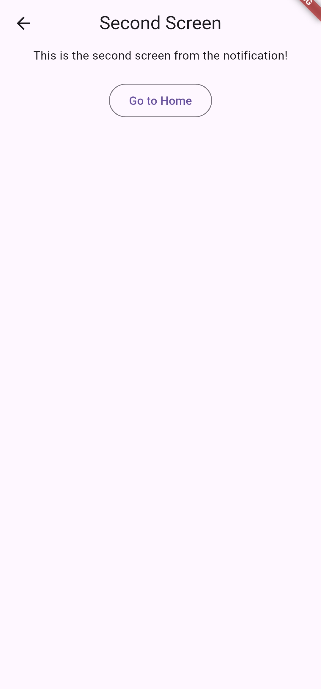

# firebase_flutter_crud

A new Flutter project.

## Getting Started

This project is a starting point for a Flutter application.

A few resources to get you started if this is your first Flutter project:

- [Lab: Write your first Flutter app](https://docs.flutter.dev/get-started/codelab)
- [Cookbook: Useful Flutter samples](https://docs.flutter.dev/cookbook)

For help getting started with Flutter development, view the
[online documentation](https://docs.flutter.dev/), which offers tutorials,
samples, guidance on mobile development, and a full API reference.

|    NRP     |      Name               |
| :--------: | :---------------------: |
| 5025221101 | Lalu Aldo Wadagraprana  |

# Assignment 3

Dalam Assignment ini saya mencoba membuat Flutter Firebase Project meliputi:
  - Firebase Firestore Database Notes
  - Firebase Authentication
  - Flutter Awesome Notification

## Firebase Firestore Database Notes

pada sections ini saya membuat Firestore database sederhana untuk menyimpan notes yang berisi:
  - notes
  - timestamp
  - title

fitur yang bisa dilakukan:
  - Create
  - Read
  - Update
  - Delete
  - Detail Notes

### 📸 Dokumentasi Screenshots

  

    
    
    
    
  

## Firebase Authentication

pada sections ini saya membuat Firebase Authentication sederhana untuk yang berisi:
  - Login
  - Register

### 📸 Dokumentasi Screenshots

  

    
    
  

## Flutter Awesome Notification

pada sections ini saya membuat awesome Notification sederhana untuk yang berisi:
  - Default Notification
  - Notification with summary
  - Proggress Bar Notification
  - Message Notification
  - Big Image Notification
  - Action Button Notification
  - Scheduled Notification

### 📸 Dokumentasi Screenshots

  

    
    
    
    
    
    
    
    
    
  

# TERIMA KASIH

